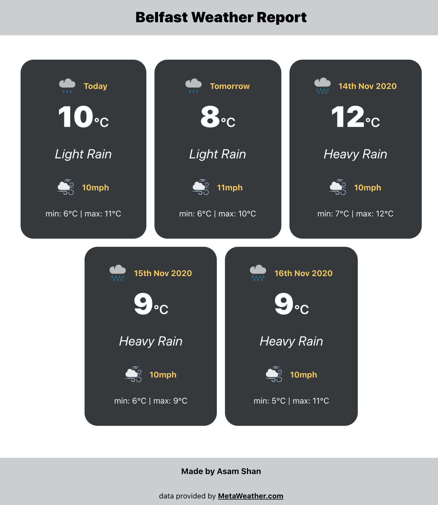

# equitas-weather-app

A React application for displaying the next 5 days weather in Belfast. Using Express server to consume the MetaWeather API.

The application is deployed via [Heroku](https://www.heroku.com), and the url is [https://equitas-weather.herokuapp.com/](https://equitas-weather.herokuapp.com/). However if you prefer to get this running locally just follow the instructions below.

## Running locally

Clone the repo, install dependencies and run the application

```
https://github.com/shan5742/equitas-weather-app.git
cd equitas-weather-app.git
npm run install-server
npm run install-client
npm run dev
```

Now you can view the application at [http://localhost:3000/](http://localhost:3000/)

## Screenshots


